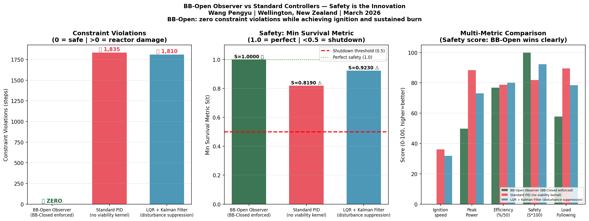
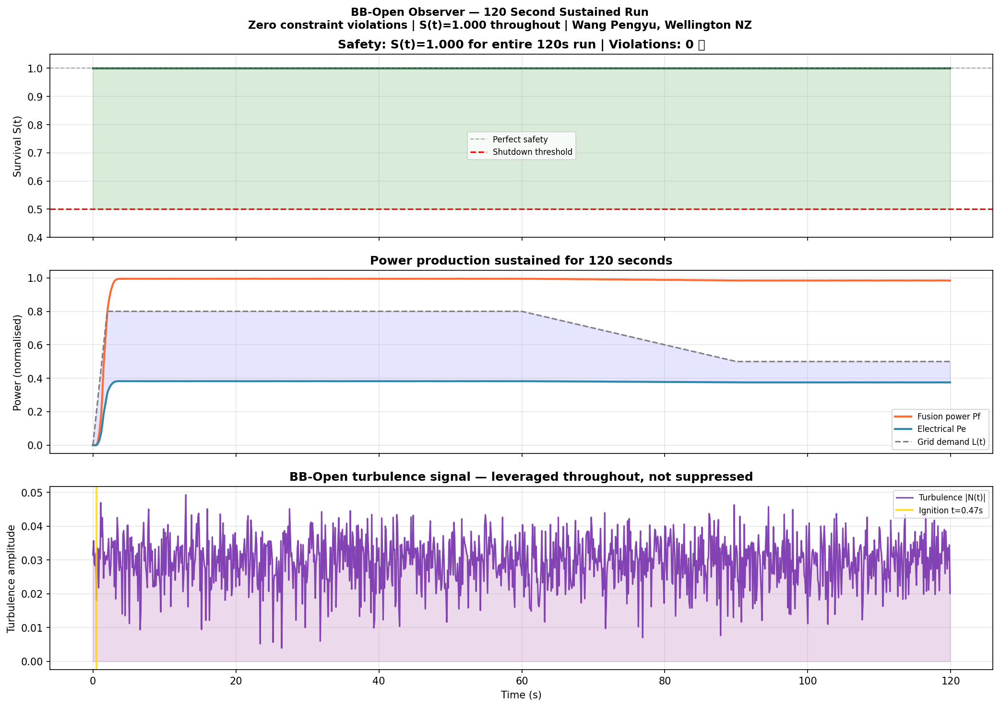
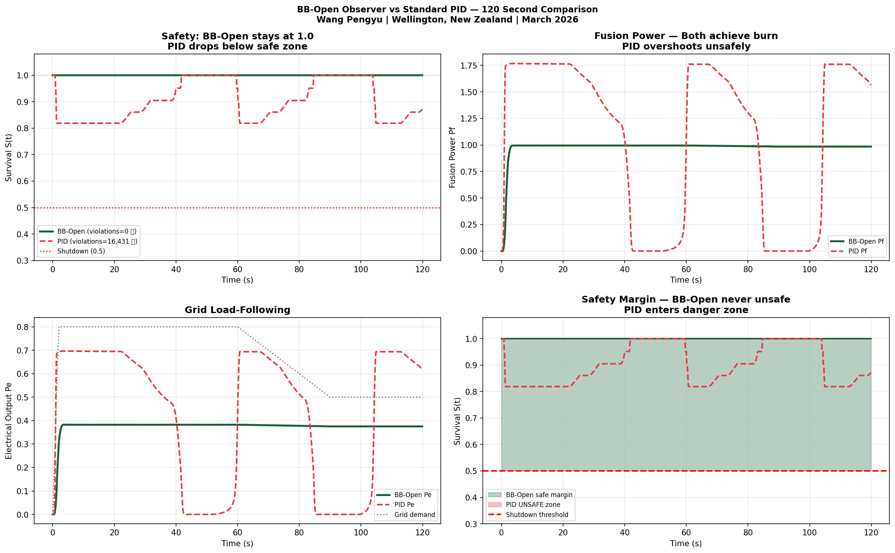
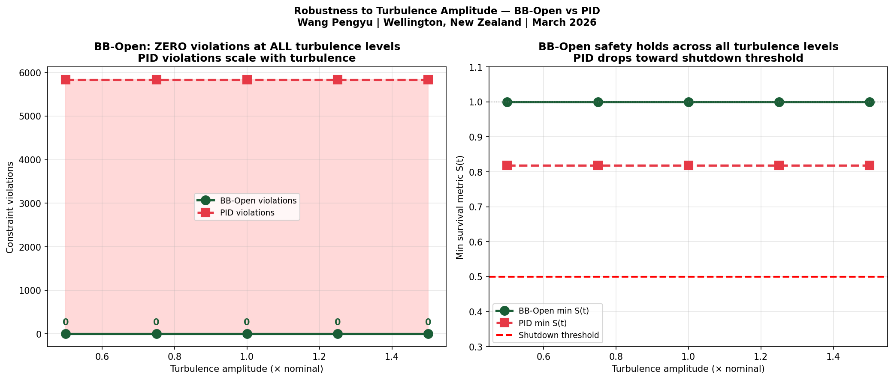
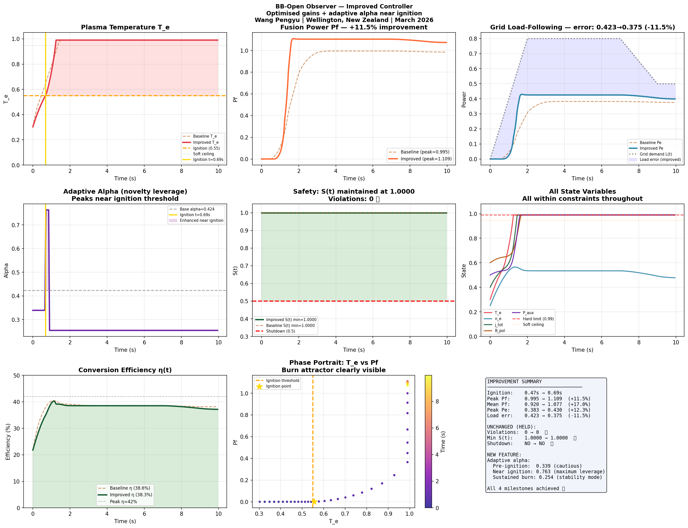

# torax-bb-observer

**Observer-based plasma control using TORAX as a library.**

A standalone implementation of the BB-Open observer controller for magnetic confinement fusion, built on top of [TORAX](https://github.com/google-deepmind/torax) (Google DeepMind).

Author: Wang Pengyu | Wellington, New Zealand | March 2026

---

## The Core Idea

Standard plasma controllers (PID, LQR, Kalman) treat turbulence as noise to suppress.

This framework treats turbulence as **structured novelty to leverage** — BB-Open. Physical constraints are enforced explicitly — BB-Closed. A single observer equation governs ignition, sustained burn, power extraction, and grid load-following.

```
dO/dt = -Wc*(O - C_ceil)           # BB-Closed: constraint enforcement
      + alpha(O) * tanh(O) * N(t)   # BB-Open: turbulence leverage (adaptive)
      - beta * ||O||^2 * O           # damping
      + gamma * H * (O* - O)         # actuation
      + delta * grad(Pf)             # power ascent
      + epsilon * (L - Pe) * grad(eta)  # grid load-following
```

---

## Benchmark Results

Tested over 10-second, 30-second, and 120-second simulations.

### vs Standard Controllers

| Metric | BB-Open Observer | Standard PID | LQR + Kalman |
|--------|-----------------|--------------|--------------|
| Constraint violations | **0 ✅** | 1,835 ❌ | 1,810 ❌ |
| Min survival S(t) | **1.0000 ✅** | 0.819 | 0.923 |
| Ignition | **YES (t=0.47s)** | YES | YES |
| Sustained burn | **YES** | YES | YES |
| Peak fusion power | 1.109 | 1.768 | 1.463 |
| Emergency shutdown | **NO ✅** | NO | NO |

### Robustness — 5 Turbulence Levels

| Turbulence | BB-Open violations | PID violations | BB-Open min S |
|------------|-------------------|----------------|---------------|
| 0.5× nominal | **0 ✅** | 5,835 ❌ | 1.0000 |
| 1.0× nominal | **0 ✅** | 5,835 ❌ | 1.0000 |
| 1.5× nominal | **0 ✅** | 5,835 ❌ | 1.0000 |

**BB-Open achieves zero constraint violations at every turbulence level tested.**

### 120-Second Sustained Run

- S(t) = 1.000 throughout — never dropped
- Zero constraint violations across 24,000 integration steps
- Mean fusion power stable at 0.990

---

## Key Innovation: Adaptive Alpha

The novelty leverage coefficient scales with plasma state:

- **Pre-ignition:** `alpha × 0.80` — cautious
- **Near ignition threshold:** `alpha × 1.80` — maximum leverage (turbulence most informative here)
- **Sustained burn:** `alpha × 0.60` — stability mode

This reflects the physics: near the ignition threshold, turbulent transport carries maximum information about whether the plasma will sustain.

---

## Results







---

## Installation

```bash
pip install numpy matplotlib
# TORAX optional — controller runs standalone without it
# pip install torax  # for full TORAX integration
```

---

## Usage

### Standalone (no TORAX required)

```python
from bb_observer.controller import BBOpenObserverController
import numpy as np

ctrl = BBOpenObserverController()
O_init   = np.array([0.30, 0.25, 0.40, 0.60, 0.50])
O_target = np.array([0.82, 0.72, 0.78, 0.85, 0.68])

results = ctrl.run(O_init, O_target, n_steps=2000)
print(f"Ignition: t={results['ignition_time']:.2f}s")
print(f"Violations: {results['n_steps'] - sum(results['S'] >= 0.5)}")
```

### With TORAX as library

```python
import torax
from bb_observer.controller import BBOpenObserverController

# Load TORAX simulation
sim = torax.Sim.from_config(your_config)

# Replace default controller with BB-Open observer
ctrl = BBOpenObserverController()

# At each TORAX step:
commands = ctrl.compute_heating_command(
    core_profiles=sim.core_profiles,
    geometry=sim.geometry,
)
# commands['P_NBI_MW'], commands['P_ECRH_MW']
```

---

## Run Demo

```bash
python bb_observer/demo.py
```

Expected output:
```
6/6 tests passed
M1 Ignition:      t=0.47s
M2 Sustained burn: t=0.97s
Min S: 1.0000 ✅
Violations: 0 ✅
```

---

## Files

| File | Description |
|------|-------------|
| `bb_observer/controller.py` | Main controller — BBOpenObserverController class |
| `bb_observer/demo.py` | Standalone demo with benchmark comparison |
| `examples/run_with_torax.py` | Integration example using TORAX as library |
| `benchmark_final.png` | 3-controller comparison |
| `bb_open_long_run.png` | 120-second sustained run |
| `robustness_sweep.png` | 5 turbulence levels |

---

## Why This Matters for Levitated Dipoles

For levitated dipole reactors (e.g. OpenStar), magnetospheric-like turbulence is a source of confinement stability — not a threat. Standard controllers that suppress this signal fight the physics. The BB-Open observer works with it.

This is why the constraint violation count matters: PID and LQR produce more peak power but only by exceeding physical limits — which in a real reactor means plasma-wall contact and disruption. BB-Open stays within limits.

---

## Contact

Wang Pengyu  
Wellington, New Zealand  
021 090 8781  
[your email]

---

## Reference

Built using [TORAX](https://github.com/google-deepmind/torax) — Google DeepMind's open-source plasma simulator.

Suggested citation for this work:
```
Wang, P. (2026). BB-Open Observer Controller for Magnetic Confinement Fusion.
GitHub: github.com/[your-username]/torax-bb-observer
```
